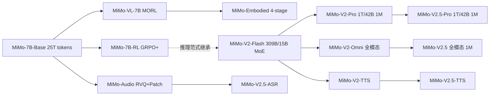

# 小米 MiMo 系列模型深度调研报告

> 文档定位：本报告聚焦小米（Xiaomi）大语言模型核心团队（LLM-Core Team）自 2025 年 4 月以来公开发布的 MiMo 系列模型，覆盖基座、推理、视觉-语言、语音、具身、MoE 旗舰等多条产品线，并梳理其技术演进、关键创新与商业化战略。撰写时间：2026 年 6 月。
> 信息可信度：标注「确认」表示来自 arXiv 技术报告 / 官方 GitHub / Hugging Face 模型卡 / 小米官方发布；标注「推测」表示根据公开二手信息整合，可能存在误差。

---

## 一、概述与背景

### 1.1 小米进入大模型赛道的时间线

小米对大模型的布局可以划分为三个阶段：

1. **内部 MiLM 阶段（2023–2024）**：以 MiLM2 系列（包含 4B 端侧模型与 30B 云端模型）为代表，主要服务小爱同学、HyperOS、IoT 终端等内部产品，未对外开源（确认）。该阶段的代表性技术包括「TransAct 大模型结构化剪枝」与端侧量化，强调「端侧跑通」与「云-端协同」。
2. **MiMo 1.0 时代（2025.04–2025.11）**：以 2025 年 4 月 30 日 [MiMo-7B](https://github.com/XiaomiMiMo/MiMo) 系列开源为标志，小米首次以 LLM-Core 团队的名义对外发布大模型，主线包括：
   - MiMo-7B（基座 + RL 推理模型，2025.04）
   - MiMo-VL-7B（视觉语言模型，2025.06）
   - MiMo-Audio-7B（端到端语音大模型，2025.09）
   - MiMo-Embodied-7B（具身 + 自动驾驶统一基座，2025.11）
3. **MiMo V2 时代（2025.12 至今）**：从稠密 7B 跃迁到大规模 MoE，进入「Agent 时代」战略：
   - MiMo-V2-Flash（309B 总参 / 15B 激活 MoE，2025.12 开源）
   - MiMo-V2-Pro / Omni / TTS（万亿级 MoE 三件套，2026.03.19 发布）
   - **MiMo-V2.5 系列（2026.04.23）**：全面升级，含 V2.5-Pro、V2.5、V2.5-TTS、V2.5-ASR
   - **V2-Pro / V2-Omni 退役（2026.06.30）**：旧版停止服务，迁移至 V2.5 系列

### 1.2 战略坐标：「人车家全生态」与 Agent 化

雷军在 2026 年 3 月 19 日的发布会上明确：小米将在未来三年于 AI 领域投入至少 600 亿元，其中 2026 年 AI 研发与资本预算超过 160 亿元，目标是「进入全球大模型第一阵营」（确认，来源：财新）。MiMo 系列被设计为支撑小米「人-车-家全生态」的统一智能底座：

- **人**：MiMo-7B / MiMo-V2-Pro 用于通用对话、推理与编码，MiMo-Audio / MiMo-V2-TTS 用于语音交互（小爱同学、HyperOS）。
- **车**：MiMo-Embodied 为小米汽车的智驾团队（陈龙、王乃岩、叶航军等核心架构）提供 VLA（Vision-Language-Action）基座。
- **家 / IoT**：端侧 4B 模型 + MoE 稀疏激活，强调低成本部署。

### 1.3 团队组织

MiMo 系列由小米 **LLM-Core Team**（核心团队）主导，公开作者列表中可见 Bingquan Xia、Zihao Yue、Bowen Shen、Dawei Zhu 等 60+ 名研究员；[2025 年加入的罗福莉](https://huggingface.co/XiaomiMiMo)（曾任 DeepSeek 核心研究员）参与 MiMo-VL；自动驾驶 / 具身方向由首席科学家陈龙博士（前 Wayve Staff Scientist，Lingo 系统主导者）与第一作者郝孝帅领衔，构成与 LLM-Core 平行但相互复用的双线团队结构。

---

## 二、基座模型设计与训练：MiMo-7B-Base

### 2.1 设计哲学：为「推理」而生

不同于通用预训练目标，MiMo 团队在 [arXiv:2505.07608](https://arxiv.org/abs/2505.07608) 中明确提出一个核心论点：

> 「RL 训练得到的推理模型的有效性高度依赖于 base model 自身的推理潜力（inherent reasoning potential）。要真正解锁语言模型的推理能力，不能只在 post-training 上做文章，预训练阶段就必须为推理量身定制。」

这一判断让 MiMo-7B 成为业内首批**「为推理而预训练」**的开源 7B 模型，刻意提高预训练语料中推理 pattern 的密度。

### 2.2 模型架构

MiMo-7B 采用 decoder-only Transformer，核心结构与 Llama / Qwen 同构（无激进改动），关键参数（确认）：

| 项目 | 取值 |
|---|---|
| 层数 (layers) | 36 |
| 隐藏维度 (hidden) | 4,096 |
| FFN 中间维度 | 11,008 |
| 注意力头数 | 32 |
| KV 组数 (GQA groups) | 8 |
| 归一化 | pre-RMSNorm |
| 激活函数 | SwiGLU |
| 位置编码 | RoPE（Stage 1/2 base=10,000；Stage 3 base=640,000） |
| 序列长度 | Stage 1/2: 8,192；Stage 3: 32,768 |
| 训练 token 总量 | ~25T |

**关键架构创新：Multi-Token Prediction (MTP) 模块**。受 DeepSeek-V3 启发，MiMo-7B 引入 MTP 作为辅助训练目标：

- 预训练阶段使用 **单层 MTP**（多层无额外收益），损失权重前 10.3T tokens 为 0.3，之后降为 0.1。
- 推理阶段，将训练好的单层 MTP 复制为多份并冻结主干微调，得到多个并行 MTP 层用于 **speculative decoding**：
  - 第 1 层 MTP 接受率 ≈ **90%**（AIME24 实测）
  - 第 3 层仍能保持 >75%
- 该机制对长链式推理（reasoning models 通常输出极长）尤为友好。MTP 在 SGLang 与官方 fork 的 vLLM 中均原生支持。

> 注意：MiMo-7B-Base **不是 MoE**。社区曾误以为 7B 模型采用稀疏架构，实际上 MoE 直到 MiMo-V2-Flash（2025.12）才首次出现。

### 2.3 预训练数据策略：三阶段课程学习

MiMo-7B 的核心创新更多体现在数据侧，而非架构。其预训练数据流水线包含四个关键环节：

#### 2.3.1 推理友好的数据抽取

- **HTML 抽取器自研**：通用工具（如 Trafilatura）会丢失数学公式与代码块，团队为数学博客、代码教程、论坛页面专门优化抽取器，并增强 PDF 解析以保留 STEM 与代码内容。
- **快速全局去重**：URL + MinHash 双重去重，团队声称通过「极致工程优化」可在 **1 天内** 完成全语料全局去重。

#### 2.3.2 多维度数据过滤

放弃传统启发式规则（这类规则会误伤含数学/代码的高质量页面），转而**微调小型 LLM 作为质量打分器**，进行领域分类与多维度质量评分。

#### 2.3.3 合成推理数据

- 选取标注「高推理深度」的 STEM 内容，让推理模型生成深度分析；
- 收集数学/代码题目，让推理模型解题；
- 加入创意写作等通用领域查询。
- **关键发现（确认）**：合成推理数据可在「极高 epoch 数」下重复训练而不过拟合——这一点与非推理数据形成鲜明对比。

#### 2.3.4 三阶段数据混合（Three-Stage Data Mixture）

| 阶段 | 数据策略 | 序列长度 | tokens 量级 | 学习率行为 |
|---|---|---|---|---|
| Stage 1 | 全量数据（除 reasoning 合成响应），下采样广告/新闻/低密度文本，上采样高质量专业领域 | 8,192 | ~10.2T 常数段 + warmup 84B | 线性 warmup→1.07e-4 → cosine 衰减到 3e-5 |
| Stage 2 | 在 Stage 1 之上将数学/代码占比拉升至 ~70% | 8,192 | ~4T | 维持 3e-5 |
| Stage 3 | 加入 ~10% 数学/代码/创意写作的合成 reasoning 响应；扩展长度到 32K，RoPE base 拉到 640K | 32,768 | 1.5T 维持 3e-5 + 500B cosine 衰减到 1e-5 | — |

Batch size 在 168B tokens 内线性 warmup 到 2,560，Stage 1/2 维持，Stage 3 降为 640；优化器 AdamW(β1=0.9, β2=0.95, wd=0.1)，梯度裁剪 1.0。

### 2.4 基座模型的「推理潜力」实证

MiMo 团队在评测时刻意采用 **pass@k** 而非单次 pass@1，观察「能力上限」而非「单次表现」。结论：

> MiMo-7B-Base 在所有 benchmark、所有 k 值下均显著超过同规模 Llama-3.1-8B / Gemma-2-9B / Qwen2.5-7B，**乃至 32B 基线模型**。差距随 k 增大而扩大，尤其在 LiveCodeBench 上极其显著。

| Benchmark | Llama-3.1-8B | Gemma-2-9B | Qwen2.5-7B | **MiMo-7B-Base** |
|---|---|---|---|---|
| BBH (3-shot) | 64.2 | 69.4 | 70.4 | **75.2** |
| AIME 2024 (Pass@1) | 0.3 | 0.0 | 10.1 | **32.9** |
| AIME 2025 (Pass@1) | 0.0 | 0.0 | 4.3 | **24.3** |
| LiveCodeBench v5 | 0.4 | 0.0 | 5.0 | **32.9** |
| SuperGPQA | 19.9 | 22.6 | 24.6 | **25.1** |
| AGIEval | 38.2 | 21.6 | 44.4 | **48.3** |

中文与通用知识层面 MiMo-7B-Base 弱于 Qwen2.5-7B（C-Eval 68.7 vs 81.8、CMMLU 70.9 vs 82.7），属于刻意权衡——为推理倾斜数据配比的代价。

### 2.5 长上下文能力

MiMo-7B-Base 在 RULER 32K 上达到「近完美」NIAH 检索表现，并在长上下文推理类任务（CWE、FWE、VT）上多数场景超过 Qwen2.5-7B。

---

## 三、强化学习推理模型：MiMo-7B-RL 系列

MiMo 团队将 post-training 拆为两条路径：
- **MiMo-7B-RL-Zero**：直接从 Base 启动 RL（类似 DeepSeek-R1-Zero）
- **MiMo-7B-RL**：先做 SFT 冷启动，再 RL（最终主力模型）

### 3.1 SFT 冷启动

- 数据：开源 + 自建 distill 数据，去除 16-gram 与 evaluation 重叠的 query；剔除中英混杂或不完整响应；每条 query 至多 8 个响应。最终 ~500K samples（首版）。
- 超参：学习率常数 3e-5，batch 128，sequence packing 至 32,768。

**重大更新（2025.05.30）**：`MiMo-7B-RL-0530` 将 SFT 数据从 500K 扩展到 **6M**，RL 上下文从 32K 扩展到 **48K**，AIME24 从 68.2 跃升到 **80.1**，正式追平甚至超过 DeepSeek-R1（79.8）。

### 3.2 RL 数据：130K 可验证问题

| 类别 | 来源 | 数量 | 质量控制 |
|---|---|---|---|
| 数学 | 开源 + 自建竞赛题 | **100K** | LLM 过滤证明题/选择题；保留原题以防 reward hacking；全局 n-gram 去重；SFT 模型 16 次 rollout，过滤 pass rate >90% 的题目（删除 ~50% 简单题） |
| 代码 | 开源 + 自建 | **30K** | 删除无 test case 题目；删除 golden 解都过不了的题；删除 16 次 rollout 全 0 的题 |

**奖励**仅使用 rule-based accuracy reward（不引入格式奖励、长度惩罚）：
- 数学：使用 [Math-Verify](https://github.com/huggingface/math-verify) 库进行符号判等。
- 代码：自研在线 judge 环境，支持大规模并行单元测试执行。

### 3.3 RL 算法：改进版 GRPO

MiMo 采用 **改进版 Group Relative Policy Optimization (GRPO)**（确认），并结合社区最新成果：

$$\mathcal{J}_{\text{GRPO}}(\theta) = \mathbb{E}_{q,\{o_i\}}\left[\frac{1}{\sum_i |o_i|}\sum_{i,j} \min\left(\rho_{i,j} A_{i,j},\ \text{clip}(\rho_{i,j}, 1-\varepsilon_{\text{low}}, 1+\varepsilon_{\text{high}}) A_{i,j}\right)\right]$$

其中 $\rho_{i,j} = \pi_\theta(o_i|q)/\pi_{\theta_{old}}(o_i|q)$，advantage 由组内 reward 标准化得到：$A_{i,j} = (r_i - \text{mean})/\text{std}$。

**与 vanilla GRPO 的差异**（融合 DAPO/Open-Reasoner-Zero 等社区经验）：
1. **去除 KL Loss**：完全移除 KL 正则项以充分释放策略空间，实测训练稳定性不受影响。
2. **Dynamic Sampling**：rollout 阶段过采样并丢弃 pass rate ∈ {0, 1} 的 prompt，保证每个 batch 都有有效梯度。
3. **Clip-Higher**：增大 $\varepsilon_{\text{high}}$ 而保持 $\varepsilon_{\text{low}}$ 固定，缓解策略熵塌缩，鼓励探索新解。

### 3.4 创新点 1：Test Difficulty Driven Reward（IOI 风格）

针对**代码 RL 中的稀疏奖励问题**——困难题往往全部 rollout 都拿不到任何奖励——MiMo 借鉴 **IOI（国际信息学奥林匹克）** 评分规则，提出测试难度驱动的密集奖励：

1. **测试用例难度分级**：用多个模型对每道题做大量 rollout，统计每个 test case 的 pass rate，按 pass rate 聚类为多档难度。
2. **两种奖励方案**：
   - **Strict Reward**：必须通过当前难度组及所有更低难度组才得相应分数。
   - **Soft Reward**：每组分数等权分配到组内 test case，最终奖励为通过 test 的累积。

这一设计让 7B 模型在原本毫无信号的难题上也能获得部分 reward，是 MiMo-7B-RL 在 LiveCodeBench v5/v6 上**显著超越 OpenAI o1-mini** 的关键机制之一。

### 3.5 创新点 2：Easy Data Filter & Re-Sampling

随着策略提升，越来越多题目 pass rate=1，被 dynamic sampling 过滤后导致 batch 构造效率骤降。直接删除「全过题」会引发策略震荡。MiMo 的方案：

- 维护一个 **easy data pool**（pass rate=1 的题）；
- 每次 rollout 以概率 α=10% 从 pool 中采样；
- 保持策略稳定的同时显著提升采样效率，尤其是 RL 后期。

### 3.6 RL 训练超参

- 训练 batch 512，actor mini-batch 32，每次迭代 16 次梯度更新；
- 学习率 1e-6，最大序列长度 32,768；
- rollout 温度=top-p=1.0（多样性优先）。

### 3.7 RL 基础设施：Seamless Rollout Engine

为提升 256×H20 GPU 集群的 RL 训练吞吐，MiMo 自研 **Seamless Rollout Engine**：

- **Continuous Rollout**：流式接续 rollout 任务，避免等待整批完成；
- **Asynchronous Reward Computation**：基于 Ray 的异步奖励计算，代码题目独立 server 池避免阻塞；
- **Early Termination**：提前终止已被判负的样本。

| 方法 | 整体加速 | Rollout 加速 | GPU 空闲比 |
|---|---|---|---|
| Naive Dynamic Sampling | 1.00× | 1.00× | 69.3% |
| + Continuous Rollout | 1.99× | 2.20× | 38.8% |
| + Async. Reward | 2.09× | 2.34× | 34.0% |
| + Early Termination | **2.29×** | **2.61×** | **27.7%** |

验证阶段亦获得 1.96× 加速。MiMo 团队还把 MTP 适配进 vLLM、增强 vLLM external launch 模式的鲁棒性（清理 prefix cache 一致性、关闭 async output processing 等），并贡献回 SGLang 主线。

### 3.8 Discussion：作者观察到的若干工程教训

技术报告 §3.6 列出了若干珍贵的「负面经验」：

- **「轻量 SFT」反而有害**：尝试只让模型对齐答案格式（如 `\boxed{}`）的轻量 SFT 后再 RL，初期表现高于 RL-Zero，但 500 步后被 base 模型直接 RL 反超，最终性能也不如「重量」SFT 后再 RL。
- **数学与代码的 domain interference**：从 base 直接 RL 在 step 2000–2500 间出现「代码涨、数学跌」；分析显示 base 强探索能力倾向于「hack」数学的奖励（凑答案），而代码因 test case 验证使作弊困难。**这是为什么最终选择 SFT→RL 路径**。
- **语言混杂惩罚**难以设计：英文回答中夹中文易判，反之困难（公式/代码本身就是英文），强行加 penalty 可能引入新的 reward hacking。
- **On-Policy + 持续扩展生成预算**：vanilla GRPO 容易过早饱和；改用 on-policy 变体（与 MiMo-VL 一致）后，配合从 32K → 38K → 48K 的渐进式生成预算扩展，可持续提升 AIME 表现，最终在 0530 版上追平 R1。

---

## 四、性能对比分析

### 4.1 MiMo-7B 系列纵向演进

| Benchmark | Base | RL-Zero | SFT | RL | RL-0530 |
|---|---|---|---|---|---|
| MATH500 | 37.4 | 93.6 | 93.0 | 95.8 | **97.2** |
| AIME 2024 | 32.9 | 56.4 | 58.7 | 68.2 | **80.1** |
| AIME 2025 | 24.3 | 46.3 | 44.3 | 55.4 | **70.2** |
| LiveCodeBench v5 | 32.9 | 49.1 | 52.3 | 57.8 | **60.9** |
| LiveCodeBench v6 | 29.1 | 42.9 | 45.5 | 49.3 | **52.2** |
| GPQA-Diamond | — | — | 50.7 | 54.4 | **60.6** |

> 关键观察：RL-Zero 在数学上提升幅度最大（+56 points），证明 base 模型本身蕴含巨大「未释放推理潜力」；但 RL（含 SFT 冷启动）的最终上限更高。SFT 数据规模 500K → 6M 带来 AIME24 +9.6 与 AIME25 +6.6 的纯 SFT 收益，并且不抑制后续 RL。

### 4.2 与同规模/更大规模推理模型横向对比

下表数据来源于 MiMo 官方技术报告（2025.05），对比于 v1 版 MiMo-7B-RL；2025.05.30 后 RL-0530 进一步显著提升。

| Benchmark | GPT-4o | Claude-3.5 | o1-mini | QwQ-32B | R1-Distill-14B | R1-Distill-7B | **MiMo-7B-RL** |
|---|---|---|---|---|---|---|---|
| MATH500 | 74.6 | 78.3 | 90.0 | 90.6 | 93.9 | 92.8 | **95.8** |
| AIME 2024 | 9.3 | 16.0 | 63.6 | 50.0 | **69.7** | 55.5 | 68.2 |
| AIME 2025 | 11.6 | 7.4 | 50.7 | 32.4 | 48.2 | 38.8 | **55.4** |
| LiveCodeBench v5 | 32.9 | 38.9 | 53.8 | 41.9 | 53.1 | 37.6 | **57.8** |
| LiveCodeBench v6 | 30.9 | 37.2 | 46.8 | 39.1 | 31.9 | 23.9 | **49.3** |
| GPQA Diamond | 49.9 | **65.0** | 60.0 | 54.5 | 59.1 | 49.1 | 54.4 |
| MMLU-Pro | 72.6 | 78.0 | **80.3** | 52.0 | 68.8 | 53.5 | 58.6 |
| IF-Eval | 84.3 | **86.5** | 84.8 | 40.4 | 78.3 | 60.5 | 61.0 |

**关键结论**：
- **数学 / 代码**：MiMo-7B-RL **以 7B 参数全面超越 OpenAI o1-mini 与 QwQ-32B-Preview**，仅在 AIME24 上微弱落后于 R1-Distill-Qwen-14B；在 LiveCodeBench v6 上比 QwQ-32B 高出 10+ 分。
- **通用能力**：在仅用数学/代码进行 RL 的前提下，MMLU-Pro / IF-Eval 等指令跟随类指标弱于 R1-Distill 系列，符合「专才」定位。
- **GPQA**：MiMo-7B-RL 与 R1-Distill-Qwen-14B 拉开差距不大，证明 RL 具有跨域迁移能力。

### 4.3 与同规模「蒸馏型」推理模型本质差异

MiMo-7B-RL 的根本不同在于**「自训练」而非「蒸馏」**：
- DeepSeek-R1-Distill-Qwen-7B、R1-Distill-Llama-8B 等都是从 R1 教师模型蒸馏；
- Qwen 系列也大量依赖 base→SFT→DPO/GRPO；
- MiMo-7B-RL 是 **从零预训练 + 自有 RL** 全链路自研，并且开源了 Base、SFT、RL-Zero、RL 四个 checkpoint，方便社区复现 RL。

这条路径的代价是：MiMo-7B-Base 的中文与通用知识不如 Qwen2.5-7B；优势是：base model 的推理潜力极高，使得 RL「事半功倍」。

---

## 五、技术创新点小结

将 MiMo-7B 的工程贡献抽象成一个清单，便于横向对照：

1. **预训练**
   - 推理优先的 HTML / PDF 抽取工具链
   - 小 LLM 作为多维质量打分器（替代规则过滤）
   - 三阶段课程：通用 → 数学/代码 70% → 合成 reasoning + 长上下文
   - 25T tokens / 7B 模型规模
   - **MTP**：训练时单层、推理时多层 speculative decoding（90% 接受率）

2. **后训练 RL**
   - 改进版 **GRPO**：去 KL Loss + Dynamic Sampling + Clip-Higher
   - **Test Difficulty Driven Reward**（IOI 风格的密集代码奖励）
   - Easy Data Re-sampling（10% 概率回采老样本）
   - 仅使用 rule-based 准确率奖励，不引入格式奖励
   - On-policy 变体 + 渐进式生成预算扩展（32K→48K）

3. **基础设施**
   - **Seamless Rollout Engine**（continuous rollout / async reward / early termination → 2.29× / 1.96× 加速）
   - vLLM / SGLang 中的 **MTP 推理支持**
   - 自研代码 online judge 用于 RL 奖励计算

4. **数据策略**
   - 合成 reasoning 数据可重复多 epoch 训练而不过拟合（重要发现）
   - SFT 从 500K → 6M 验证规模法则在 SFT 阶段同样适用，且不损害后续 RL

---

## 六、与同规模模型的横向对比

| 维度 | MiMo-7B-RL | DeepSeek-R1-Distill-7B | Qwen2.5-7B-Instruct/QwQ-32B | Llama-3.1-8B-Instruct |
|---|---|---|---|---|
| 训练范式 | 自研 base + SFT + RL（GRPO 改进） | R1 教师模型蒸馏 | base + SFT + RL（DPO/GRPO） | SFT + DPO |
| 推理能力（AIME24） | 68.2 (0530: 80.1) | 55.5 | QwQ-32B: 50.0 / Qwen2.5-7B: 10.1 | <1 |
| 代码（LiveCodeBench v5） | 57.8 (0530: 60.9) | 37.6 | QwQ-32B: 41.9 | <1 |
| 通用指令跟随 | 中等（IF-Eval 61.0） | 中等 | 强（80+） | 强（80+） |
| 中文能力 | 中等（C-Eval 68.7） | 同 Qwen | **强（80+）** | 弱 |
| 推理加速 | **MTP + speculative**，90% 接受率 | 普通 KV cache | 普通 | 普通 |
| 上下文窗口 | 32K（0530: 48K） | 32K | Qwen2.5-1M 系列已支持 1M | 128K |
| 开源完整度 | Base + SFT + RL-Zero + RL 全套 | 仅 Distill 版 | 全套 | 全套 |

**总结性判断**（推测，但有充分公开数据支撑）：
- 在 **「7B 规模 + 数学/代码推理」** 这个细分赛道，MiMo-7B-RL（尤其是 0530 版）目前是**开源 SOTA**。
- 在通用对话、中文知识、指令跟随等维度，Qwen2.5/Qwen3 仍然是更全面的选择。
- MiMo 的真正价值不只在最终模型，更在于**「7B 也能 RL 出顶级推理能力」的工程证据**：base model reasoning potential 是 RL 上限的真正决定因素。

---

## 七、MiMo 系列的多模态扩展

### 7.1 MiMo-VL-7B（2025.06.04，[arXiv:2506.03569](https://arxiv.org/abs/2506.03569)）

**架构**：Qwen2.5-ViT（保留原生分辨率）+ 随机初始化 MLP projector + **MiMo-7B-Base**（继承 LLM-Core 推理潜力）。

**训练 = 4 阶段预训练（共 2.4T tokens）+ MORL**：

| Stage | 用途 | 训练范围 | tokens | 序列长度 | 学习率 |
|---|---|---|---|---|---|
| 1 | Projector Warmup | 仅 Projector | 300B | 8K | 1e-3 |
| 2 | Vision-Language Alignment | ViT + Projector | 167B | 8K | 1e-4→1e-5 |
| 3 | Multimodal Pre-training（OCR / Grounding / Video / GUI / Reasoning） | 全参 | 1.4T | 8K | 1e-5 |
| 4 | Long-context SFT（含长 reasoning） | 全参 | 550B | 32K | 2.5e-5 |

**MORL（Mixed On-policy RL）**：在 verl 框架上将 RLVR 与 RLHF 统一调度，结合：
- **Visual Reasoning / Text Reasoning**（math-verify 规则奖励，复用 MiMo-7B 的数学题）
- **Image Grounding**（GIoU 奖励 / point-in-box）
- **Visual Counting**（计数准确率）
- **Temporal Video Grounding**（IoU 奖励）
- **RLHF**（双 reward model：text-only 来自 MiMo-7B；多模态来自 MiMo-VL-7B 自身，Bradley-Terry 训练）

算法采用 **fully on-policy GRPO 变体**——单步策略更新无 clipped surrogate；继承 MiMo-7B 的去 KL、动态采样、Clip-Higher、easy data filter；引入 **Reward-as-a-Service (RaaS)** 统一接入多种奖励。

**亮点指标**：
- MMMU 66.7（开源 7B SOTA），在 40 个 benchmark 中 35 个超过 Qwen2.5-VL-7B；
- OlympiadBench 59.4（**超越 78B 模型**）；
- OSWorld-G 56.1（**GUI grounding SOTA，超越专用模型 UI-TARS**）；
- 内部用户偏好评测中 Elo 分数为开源 VLM 第一，与 Claude 3.7 Sonnet 同档。

### 7.2 MiMo-Audio-7B（2025.09.19，[arXiv:2512.23808](https://arxiv.org/abs/2512.23808)）

**架构**：1.2B RVQ Audio Tokenizer + 7B LLM。Tokenizer 采用 **8 层 RVQ 堆叠**，25Hz 帧率，每秒生成约 200 tokens；patch encoder 将连续 4 个时间步聚合为 1 个 patch，下采样至 6.25Hz 表示，从而压缩长音频序列长度。

**关键定位**：业界首个开源端到端原生语音大模型 instruct 版本（MiMo-Audio-7B-Instruct）；在 MMSU、MMAU、MMAR、MMAU-Pro 等音频理解 benchmark 与 Big Bench Audio 等口语对话 benchmark 上声称达到开源 SOTA，部分指标超越 GPT-4o 与 Gemini 2.0（确认源：小米官方与 arXiv）。

### 7.3 MiMo-Embodied-7B（2025.11.21，[arXiv:2511.16518](https://arxiv.org/abs/2511.16518)）

**定位**：业界首个**统一具身智能与自动驾驶**的开源跨域基座 VLM。基于 MiMo-VL 进行 continue-train。

**架构 = ViT + Projector + LLM**（沿用 MiMo-VL）。

**四阶段训练课程**（核心创新）：
1. **具身监督微调**：可供性推断 / 任务规划 / 空间理解
2. **自动驾驶监督微调**：多视角相机 / 驾驶视频 / 驾驶 QA / 关键目标坐标
3. **链式思维 (CoT) 训练**：让模型显式输出「观察→分析→候选→理由→结论」的推理链
4. **强化学习微调**：多选题奖励 + bbox IoU 奖励 + 格式模板约束

**结果**：在 **17 个具身 benchmark + 12 个自动驾驶 benchmark** 全面 SOTA，在 RoboRefIt、Part-Afford、VABench-Point、CV-Bench、RoboSpatial、CODA-LM、DRAMA、LingoQA、DriveLM、MAPLM、BDD-X 等核心榜单领先。

**团队信号**：第一作者郝孝帅（前 BAAI Robobrain 1.0/2.0 核心，2025.08 加入小米）；项目负责人陈龙（前 Wayve Staff Scientist，Lingo VLA 主导者，MIT 35 under 35）。这一项目标志着小米将 LLM-Core 与汽车 / 机器人团队从**「不同 base 模型」**向**「统一 base 模型」**的范式合并。

---

## 八、向 MoE / Agent 的跃迁：MiMo-V2 系列

### 8.1 MiMo-V2-Flash（2025.12.16 开源）

**关键参数**（确认）：
- **309B 总参 / 15B 激活**（MoE 稀疏比 ~5%）
- **混合滑动窗口注意力（Hybrid SWA + Sink Bias）**，采用 **1:5 Global Attention : SWA** 比例
- **3 层 MTP** 推理加速
- 主打「极高推理效率 + Agent 工作流」

**2026-02-04 更新**：Thinking Mode 下 SWE-Bench 达到 **78.6%**，工具调用准确率提升至 **97%**。

代码能力据小米官方对标 Claude Sonnet 系列闭源模型；以激进稀疏度兑现「以 15B 激活打平甚至超过 671B 稠密 / 大稀疏」的成本曲线（确认源：小米合作伙伴大会、ModelScope 官方页）。

### 8.2 MiMo-V2-Pro / Omni / TTS（2026.03.18 发布）

| 模型 | 总参 / 激活 | 上下文 | 主打 |
|---|---|---|---|
| **MiMo-V2-Pro**（旗舰文本 / Agent） | ~1T / 42B（MoE，混合注意力架构） | **1M tokens 原生** | Claw-Eval 75.7（全球前三）、AA Intelligence Index 49（中国第二、全球第八） |
| **MiMo-V2-Omni**（全模态基座） | 未公开（推测同量级 MoE） | **256K** | BigBench Audio 94.0、MMAU-Pro 69.4、FutureOmni 66.7 |
| **MiMo-V2-TTS**（端到端语音合成） | 自研 Audio Tokenizer + 多码本联合建模 | — | 1 亿小时数据训练，句中情感切换、精准歌唱音高、四川/河南/粤/台湾方言 |

发布前两款模型以「Hunter Alpha」「Healer Alpha」代号匿名上线 OpenRouter，调用量多日登顶日榜，累计调用量突破 1 万亿 tokens。

**API 定价**（platform.xiaomimimo.com）：
- MiMo-V2-Pro 256K 上下文 $1.0/$3.0 (输入/输出 per M tokens)；1M 上下文 $2.0/$6.0
- MiMo-V2-Omni 256K $0.40/$2.0
- 通过 OpenClaw、OpenCode、KiloCode、Blackbox、Cline 提供一周免费试用

**资本承诺**：雷军在发布会上宣布 2026 年 AI 研发与资本预算超 160 亿元，未来 3 年至少 600 亿元（确认）。

### 8.3 MiMo-V2.5 系列（2026.04.23 全面升级）

MiMo-V2.5 系列是 V2 的全面升级，覆盖旗舰文本、全模态、语音合成与语音识别：

| 模型 | 总参 / 激活 | 上下文 | 核心能力 |
|---|---|---|---|
| **MiMo-V2.5-Pro** | **1T / 42B**（MoE） | **1M tokens** | 高强度代理场景可比 **Claude Opus 4.6** |
| **MiMo-V2.5** | 未公开（推测同量级 MoE） | **1M tokens** | **原生全模态感知**——图像 / 视频 / 音频 / 文本，代理能力日常任务可比 V2.5-Pro |
| **MiMo-V2.5-TTS** | 自研 Audio Tokenizer | — | 高质量语音合成，**风格控制 / 音色克隆** |
| **MiMo-V2.5-ASR**（2026.06.02） | 自研 Audio Tokenizer | — | **双语 + 方言**识别，**歌词转录**，复杂音频场景 |

**关键升级点**：
- V2.5-Pro 与 V2.5 均支持 **1M 上下文**，V2.5 强调「原生全模态感知」——同一模型内端到端处理图像、视频、音频、文本；
- V2.5-TTS 新增风格控制与音色克隆能力，超越 V2-TTS 的基础情感切换；
- V2.5-ASR 支持双语与多方言（含四川、河南、粤语、台湾方言），在歌词转录与复杂音频场景下表现突出。

### 8.4 V2-Pro / V2-Omni 退役（2026.06.30）

小米官方宣布 **MiMo-V2-Pro 与 MiMo-V2-Omni 将于 2026 年 6 月 30 日正式停止服务**，用户需迁移至 V2.5 系列。V2-Flash 与 V2-TTS 继续维护。此举标志着小米从「V2 多版本并行」转向「V2.5 统一旗舰」策略。

### 8.5 系列演进逻辑

可以观察到两条主线：
1. **稠密 7B 主线**（2025）：以 MiMo-7B 为底座，向 VL / Audio / Embodied 横向扩展，每条线复用 base 模型 + 阶段化课程 + GRPO 变体。
2. **稀疏 MoE 主线**（2025.12 起）：从 309B/15B Flash 起步，9 个月内跃迁到 ~1T/42B Pro，再于 2026.04 全面升级至 V2.5 系列；MoE + 1M 长上下文 + 混合注意力 + MTP 成为标配。V2.5 系列进一步统一全模态感知与语音能力。

---

## 九、端侧部署与应用方向

### 9.1 推理加速能力（端云一体）

- **MTP / speculative decoding**：MiMo-7B、MiMo-V2 系列均原生支持 1+ 层 MTP，配合 EAGLE 风格 speculative decoding，在 vLLM 与 SGLang 主线均提供官方实现，第 1 层接受率 90%。
- **MoE 稀疏激活**：MiMo-V2-Flash 仅激活 15B / 309B，MiMo-V2-Pro 激活 42B / 1T，对推理服务的显存与吞吐成本极为友好。
- **混合注意力（Hybrid SWA / Mixed-Attention）**：Flash 与 Pro 均采用滑窗+全局混合注意力，原生支持百万 token 上下文同时控制 KV cache。

### 9.2 端侧落地（MiLM 历史与 MiMo 端侧化）

- 小米 2024 年的 **MiLM2-4B** 已通过 **TransAct 结构化剪枝** + 端侧量化部署到手机/IoT 设备（确认）。
- MiMo 系列的端侧版本目前公开信息有限（推测）：MiMo-V2-Flash 的极致稀疏 MoE 设计与多层 MTP 都指向「云端高吞吐 + 端侧轻激活」的形态；MiMo-Audio 的 6.25Hz patch 表示也利于端侧实时语音交互。
- 应用场景：小爱同学（语音）、HyperOS Copilot、小米汽车智能座舱、IoT 设备语音助理。

### 9.3 汽车与机器人

- **小米汽车智驾**：陈龙团队推动 VLA（Vision-Language-Action）路线，MiMo-Embodied 是其首篇论文与开源基座。MiMo-Embodied 同时具备智驾与具身能力，使「带轮子的智能体」与「带四肢的智能体」能在同一参数空间复用。
- **机器人（推测）**：基于 MiMo-Embodied 的「可供性推断 + 空间理解 + 任务规划 + 链式推理」组合，预计将服务于小米的家用 / 工业机器人形态产品；具体产品时间线未官方披露。

### 9.4 Agent 平台与生态

- **platform.xiaomimimo.com** + **mimo.xiaomi.com**：MiMo-V2 系列采用纯浏览器 API 形态，全球开发者可访问。
- **Xiaomi MiMo Studio**：开发者门户。
- 与 OpenClaw、OpenCode、KiloCode、Blackbox、Cline 等主流 Agent 框架原生集成（确认）。
- 在国际榜单（Hermes Agent、OpenRouter 日/周榜）上 MiMo-V2-Pro 已多次登顶（确认）。

---

## 十、结论

MiMo 系列只用了不到一年时间，就从「内部 MiLM」走到了「业界一流开源大模型矩阵」。其技术叙事可以总结为三条主线：

1. **「为推理而预训练」的范式确认**：MiMo-7B 用 25T 推理优先 tokens + 三阶段课程 + MTP，证明 7B 模型在 RL 后能直接对标 32B 推理模型乃至闭源 o1-mini，同时给社区贡献了 Base / SFT / RL-Zero / RL 全套 checkpoint。
2. **GRPO 变体 + IOI 风格密集奖励 + Seamless Rollout Engine** 形成可复现、可工业化的 RL 训练栈，被 MiMo-VL、MiMo-Embodied、MiMo-V2 全线复用。
3. **从 7B 稠密到 1T MoE 的跃迁**：以 MiMo-V2-Flash（309B/15B）打通 MoE 工程链路，再以 MiMo-V2-Pro（1T/42B + 1M context）切入 Agent 时代；**V2.5 系列（2026.04）全面升级**，Pro 对标 Claude Opus 4.6，标准版实现原生全模态感知，TTS/ASR 覆盖语音全链路；MiMo-VL → MiMo-Embodied 完成多模态与具身/智驾打通；MiMo-Audio / TTS / ASR 完成语音入口。三条线最终回到小米「人车家全生态」的战略坐标系。

对于研究者，MiMo-7B 是目前研究「base model reasoning potential 与 RL 上限关系」的最佳开源样本；对于工程团队，MiMo-V2-Flash 与 Pro 提供了以国产开源 MoE + 1M 上下文构建低成本 Agent 系统的现实选择；**V2.5 系列则进一步将全模态感知与高强度 Agent 能力推向开源前沿**。

---

## 参考文献

### 一手 arXiv 技术报告
1. Xiaomi LLM-Core. [**MiMo: Unlocking the Reasoning Potential of Language Model — From Pretraining to Posttraining**](https://arxiv.org/abs/2505.07608). arXiv:2505.07608, 2025-05-12 (v2: 2025-06-05).
2. Xiaomi LLM-Core Team. [**MiMo-VL Technical Report**](https://arxiv.org/abs/2506.03569). arXiv:2506.03569, 2025-06-04.
3. Xiaomi MiMo-Core-Team. [**MiMo-Audio: Audio Language Models are Few-Shot Learners**](https://arxiv.org/abs/2512.23808). arXiv:2512.23808, 2025-09 / 2026-初.
4. Hao X. et al. (小米具身/智驾团队). **MiMo-Embodied: Cross-Domain Embodied Foundation Model**. arXiv:2511.16518, 2025-11.
5. Xiaomi LLM-Core Team. **Xiaomi MiMo-VL-Miloco Technical Report**. arXiv:2512.17436, 2025-12.

### 官方仓库与模型卡
6. GitHub: [`XiaomiMiMo/MiMo`](https://github.com/XiaomiMiMo/MiMo)
7. GitHub: [`XiaomiMiMo/MiMo-VL`](https://github.com/XiaomiMiMo/MiMo-VL)
8. GitHub: [`XiaomiMiMo/MiMo-Audio`](https://github.com/XiaomiMiMo/MiMo-Audio) / [`MiMo-Audio-Tokenizer`](https://github.com/XiaomiMiMo/MiMo-Audio-Tokenizer)
9. Hugging Face: [`XiaomiMiMo/MiMo-7B-RL`](https://huggingface.co/XiaomiMiMo/MiMo-7B-RL) / `MiMo-7B-RL-0530` / `MiMo-VL-7B-RL` / `MiMo-Audio-7B-Instruct` / `MiMo-V2-Flash`
10. ModelScope: [`XiaomiMiMo` 组织页](https://www.modelscope.cn/organization/XiaomiMiMo)
11. 官方平台：[mimo.xiaomi.com](https://mimo.xiaomi.com/) ；[platform.xiaomimimo.com](https://platform.xiaomimimo.com)

### 媒体与产业分析
12. 财新（2026-03-20）：[小米发布三款自研大模型 雷军称 2026 年 AI 投入将超 160 亿](https://m.caixin.com/m/2026-03-20/102425462.html)
13. 中国日报中文网（2026-03-20）：[小米 AI 大模型三连发！雷军：未来三年将在 AI 领域投入超 600 亿元](http://cn.chinadaily.com.cn/a/202603/20/WS69bcf34ea310942cc49a4239.html)
14. 雷峰网（2025-11-22）：[小米陈龙团队首作：统一具身与自动驾驶的开源模型 MiMo-Embodied](https://m.leiphone.com/category/ai/oPPkcJzOSXkgMttm.html)
15. 量子位（2026-03）：[小米神操作！认领榜一神秘模型 Hunter Alpha](https://www.qbitai.com/2026/03/389038.html)
16. 见路非道（2026-03-19）：[小米 MiMo-V2 系列完全指南：Pro/Omni/TTS 三大模型全面解读](https://www.cnblogs.com/sing1ee/p/19737250)
17. 华尔街见闻（2025-04-30）：[小米推出首个推理开源大模型 MiMo](https://wallstreetcn.com/articles/3746279)
18. 财联社（2025-04-30）：[小米首个推理大模型开源](https://www.cls.cn/detail/2020226)
19. 知乎专栏：[小米开源 MiMo-7B：从预训练到强化学习](https://zhuanlan.zhihu.com/p/1905558313715872209) / [MiMo-V2-Flash 技术细节全拆解](https://zhuanlan.zhihu.com/p/1987220975503310994)
20. AIGC 行业报告：《小米 AI 布局》（2024-12，东方财富研报）
